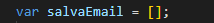
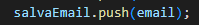
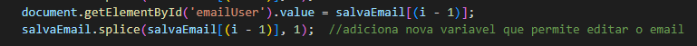
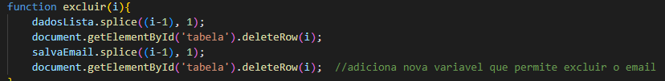

# PROJETO LOGIN CAD V2.0

### ÍNDICE 

* [Introdução](#introdução)
* [Descrição](#descrição)
* [Funcionalidades](#funcionalidades)
* [Fontes](#fontes)
* [Autor](#autor)

## `Introdução`  
Este projeto é uma versão melhorada e aprimorada de [LOGIN CAD v2](https://github.com/manuelaaraujo/login-cad-v2), onde arrumamos erros do antigo trabalho, que tinha como objetivo adicionar avanços na tela de cadastro permitindo que o usuário consiga adicionar um novo Email, salvar, editar ou exclui-lo. Também adicionamos uma melhoria que permite agora preencher o campo de CPF, validando o mesmo. 

## `Descrição`

### O QUE É O ``ARRAY``?

Um array é um conjunto de valores ordenados que você o referencia com um nome e um índice. Por exemplo, você pode ter um array chamado emp que contém nomes de funcionários indexados por seus números de funcionários.

     `ARRAY.SPLICE` O método splice() altera o conteúdo de uma lista, adicionando novos elementos enquanto remove elementos antigos. Índice o qual deve iniciar a alterar a lista. Se maior que o tamanho total da mesma, nenhum elemento será alterado. Se negativo, irá iniciar a partir daquele número de elementos a partir do fim.

* TELA LOGIN

A função acessar() valida se os campos de email e senha estão preenchidos. Se algum campo estiver vazio, exibe um alerta. Caso contrário, redireciona o usuário para a página cadastro.html

* TELA CADASTRO 

 ``salvarUser()``: Adiciona o nome do usuário a um array (dadosLista) e atualiza uma tabela HTML com uma nova linha contendo o nome e botões para editar e excluir. Limpa o campo de entrada após adicionar o nome.`

``criarlista()``: Gera e exibe uma tabela HTML com os nomes armazenados no array dadosLista. Inclui botões para editar e excluir cada entrada.

``editar(i)``: Permite editar um nome na lista. Preenche o campo de entrada com o nome selecionado e remove o nome do array.

``excluir(i)``: Remove um nome da lista e da tabela HTML com base na posição fornecida.

`DESCRIÇÃO DA NOVA ALTERAÇÃO FEITA NO PROJETO`

Cria um array vazio chamado "salvaEmail" com o propósito de armazenar os endereços de e-mail dos usuários conforme eles são adicionados à lista.

Adiciona um novo endereço de e-mail ao final do array "salvaEmail". Isso ocorre na função salvarUser(), onde, após o usuário inserir o nome e o e-mail, o e-mail é armazenado no array para que possa ser exibido na tabela.

Esta linha define o valor do campo de entrada com id "emailUser" para o valor localizado no array "salvaEmail" no índice (i - 1). O que faz: Preenche o campo de entrada emailUser com o valor do item no índice (i - 1) do array salvaEmail.

 

 "deleteRow(i)" remove a linha da tabela com o índice i. Esse índice corresponde à linha da tabela que será removida.
Remove um item do array salvaEmail. Usa o índice (i - 1) para determinar o ponto de início da remoção. O segundo argumento 1 especifica que um item deve ser removido a partir desse índice.

## `Funcionalidades`

O código permite a validação de login e o gerenciamento de uma lista de usuários, incluindo funcionalidades para adicionar, editar e excluir nomes.

## `Fontes`

[CHAT GPT](https://chatgpt.com/)

[MDN WEB DOCS](https://developer.mozilla.org/pt-BR/docs/Web/JavaScript/Guide/Indexed_collections)

## `Autor`

[Leonardo Rocha](https://github.com/LeonardoRochaMarista)

[Manuela Araujo](https://github.com/manuelaaraujo)